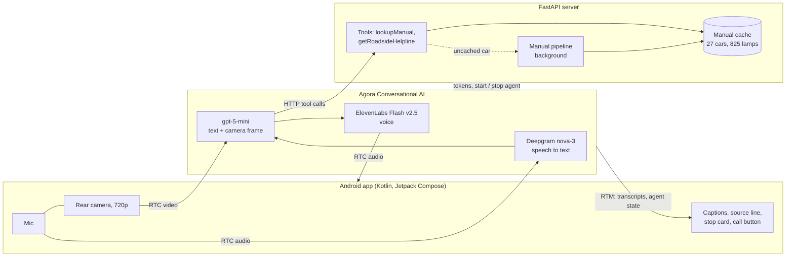

# DashLens

**A hands-free voice and camera co-driver that explains dashboard warning lights from your car's own owner's manual.**

Point your phone at the instrument cluster and ask, out loud, "what's this light?". DashLens sees the lamp, looks up that exact car's owner's manual, asks the one question that changes the answer (is the engine running? is the parking brake on?), and tells you what to do in a sentence or two. If you need to stop, it shows the carmaker's verified roadside helpline, one tap from the dialler.

Built for the **Agora Voice AI Hackathon (AI Mobile Coders)** on Agora Conversational AI.

> **Demo video:** _link coming_

---

## The problem

A warning lamp comes on while you're driving. The answer is in a 450–700 page owner's manual in the glovebox, which you can't read while driving. Google Lens and general chatbots give generic answers: they don't know your car, whether the engine is running, or that on most Indian cars the red brake lamp is also the handbrake lamp. A wrong "pull over now" is stressful; a wrong "it's fine" is dangerous.

## What DashLens does

- **Talk, don't type.** Fully voice-driven with barge-in: say "wait" and it stops.
- **It looks.** The phone's rear camera streams to the agent in real time, and the LLM sees the latest frame with every question. It reads written warning messages on the display, the rev counter, and the lamp symbols.
- **Your car, not cars in general.** As soon as it hears the make and model it calls a tool that returns that car's lamps from its own owner's manual (27 popular Indian cars cached, more fetched on demand).
- **It asks before it guesses.** Engine off and many red lamps? That's the start-up self-check. Red brake lamp on a stationary car? It asks you to release the parking brake and watch the lamp. Can't read a small icon? It asks you to bring the phone closer.
- **It ends in an action.** For a stop-now lamp it shows a red **Stop the car safely** card with the carmaker's verified roadside number; tap it to open the dialler.
- **Honest about sources.** The screen shows `MG Astor · owner's manual`, `· general guidance` or `· finding manual…`, so you always know where an answer comes from.

## How it works



### Agora integration

| Piece | How DashLens uses it |
|---|---|
| **Conversational AI engine** | Cascade pipeline started per call by the server through the `agora-agents` Python SDK: Deepgram nova-3 ASR → gpt-5-mini (Agora-managed, low reasoning effort) → ElevenLabs Flash v2.5 TTS. |
| **Vision input** | The LLM is configured with `input_modalities: ["text", "image"]`; Agora forwards the latest frame of the user's RTC video stream with each turn. |
| **RTC video** | The app publishes the rear camera at 720p/30 fps. A pre-encoder frame observer (`UprightFrameRotator`) rotates frames so the agent always sees the dashboard upright, even with the phone held sideways to fit a wide cluster, while the app UI stays portrait. |
| **Tools** | Two HTTP tools the agent calls synchronously: `lookupManual(make, model)` and `getRoadsideHelpline(make)`. Each agent gets a session id in its tool URL, so the server can check that a car model was actually said in the call before fetching a manual (the LLM sometimes invented one). |
| **RTM** | Live transcripts and agent state (listening / thinking / speaking) drive the word-by-word caption and status pill. |
| **Screen tags + TTS `skip_patterns`** | Tool results include a ready-made tag such as `{car:MG Astor\|manual\|MG Motor India helpline\|18001006464}`. The agent copies it into its reply; TTS skip pattern 5 keeps anything in curly braces silent, and the app turns it into the source line and the call button. |
| **Interruption** | Keyword barge-in ("stop", "wait", "hold on", …) so road noise and the radio don't cut the agent off, while the driver still can. |
| **Turn analytics** | After each call the server saves Agora's per-turn latency breakdown (ASR, LLM, TTS) with the transcript and the camera frames the LLM saw, which is how the numbers below were measured. |

### The manual pipeline

For a car that isn't cached yet, a background job finds and reads its owner's manual so the next question is instant:

1. **Find candidates**: Maruti Suzuki and Nexa's own manual feeds first, then Tavily and Serper web search. Candidates are scored (model name present, Indian edition preferred, brochures, EV variants and other markets penalised).
2. **Verify the PDF**: must be a real manual (50+ pages, warning-lamp content).
3. **Keep only the lamp pages**: a 450–700 page manual is cut to roughly 26 pages.
4. **Structure it**: Gemini turns those pages into JSON (lamp, colour, steady meaning, flashing meaning), falling back across several models when one is overloaded, and to the manual's raw lamp text if all fail.
5. **Cache**: `server/cache/<make>_<model>.json`. Cached answers return in under 10 ms.

While that runs, the agent says the manual is being fetched and gives clearly labelled general guidance, instead of leaving the driver in silence.

Roadside helplines come from a hand-verified table of 12 brands (each checked on the carmaker's site); the agent never makes up a number.

## Measured results

Measured from saved test calls, in a real MG Astor and on photos of Kia and Hyundai clusters.

| Metric | Result |
|---|---|
| Voice round trip (you stop talking → voice starts), median | **5.1 s** at low reasoning (3.3 s at minimal) |
| └ speech recognition / LLM first token / voice first audio | 0.64 s / 3.3 s / 0.27 s |
| Lamp identification, red warning lamps | 11 / 15 correct (73%) |
| Lamp identification, written messages and panels | 2 / 2 |
| Lamp identification, overall | 15 / 22 (68%) |
| Manual coverage | 27 cars, 8 brands, 825 lamps; 19 manuals from carmakers' own sites |
| Cached manual lookup | 7 ms |

Low reasoning costs about 2 s per reply but reads the rev counter itself, asks instead of guessing, and asks for a closer look when an icon is unclear; for safety advice that trade is worth it. Misses were mostly tiny or blurred icons at night and indicators the manual describes only by name (see limitations).

## Setup

### Prerequisites

- Android Studio (JDK 17+) and an Android phone with a camera (Android 7.0, API 24+)
- Python 3.10+
- An [Agora](https://console.agora.io) project with Conversational AI enabled (App ID and App Certificate)
- An HTTPS tunnel such as [ngrok](https://ngrok.com), so Agora's cloud and the phone can reach your server
- Optional: an ElevenLabs API key (the demo voice; without it the agent uses Agora-managed OpenAI TTS), and Gemini, Tavily and Serper keys (only needed to add cars that aren't cached)

### 1. Server

```bash
cd server
python -m venv .venv
source .venv/bin/activate          # Windows: .venv\Scripts\activate
pip install -r requirements.txt
cp .env.example .env.local         # then fill in the keys
```

In `server/.env.local` set at least `AGORA_APP_ID` and `AGORA_APP_CERTIFICATE`. For the demo voice also set `TTS_VENDOR=elevenlabs`, `ELEVENLABS_API_KEY` and `TTS_VOICE_ID`.

### 2. Tunnel

```bash
ngrok http 8000
```

Put the HTTPS URL into `server/.env.local` as `PUBLIC_BASE_URL=https://…`. The manual and helpline tools are only registered when this is set, because Agora's cloud calls them over the internet.

### 3. Run the server

```bash
cd server
python -m uvicorn app.main:app --host 127.0.0.1 --port 8000
```

`GET /health` should return `"agora_configured": true`.

### 4. App

Add the same tunnel URL to `local.properties` in the project root (or run `./server/configure-android.sh https://…`):

```properties
DASHLENS_SERVER_URL=https://your-tunnel.ngrok-free.app
```

Open the project in Android Studio and run the `app` configuration on your phone. Grant microphone and camera access, tap **Start**, tell it your car, and point the camera at the lamp.

### Tests

```bash
./gradlew :app:testDebugUnitTest     # app unit tests
cd server && python -m pytest -q     # server tests
```

## Project structure

```
app/src/main/java/com/dashlens/app/
  ui/ClusterScreen.kt                 the single screen: camera, captions, source line, stop card
  ui/AgentTags.kt                     reads the agent's screen tags and stop advice
  rtc/AgoraConversationSessionManager.kt   RTC + RTM session, camera, zoom, barge-in
  rtc/UprightFrameRotator.kt          keeps the frames the agent sees upright
server/app/
  agora_client.py                     agent config (ASR, LLM, TTS, tools, prompt), transcripts, metrics
  routes.py                           API: tokens, join/leave, tool endpoints
  manual/manual_pipeline.py           find, verify and structure owner's manuals
  manual/helplines.py                 verified roadside helplines
server/cache/                         structured lamp data for 27 cars
```

## Built on

DashLens started from Agora's [agent-quickstart-android](https://github.com/AgoraIO-Conversational-AI/agent-quickstart-android) (MIT): the Kotlin RTC/RTM session layer, the token-minting FastAPI server and its scripts. Everything specific to DashLens was built during the hackathon: the camera pipeline and upright frame rotation, the cluster UI, the agent prompt and tools, the manual pipeline and cache, the helpline table, the screen tags, the server-side model check, and transcript and metrics capture. Camera-to-LLM vision follows the pattern from Agora's vision recipe.

While building it I found and fixed a quickstart bug: the RTM client wasn't released on disconnect, so a second session in the same app run failed with `INVALID_TOKEN` (`client.release()` in `disconnect()` and in the `ensureRtmClient` error path).

## Limitations and what's next

- **Small icons.** At arm's length at night a lamp can be ~25 px in a 720p frame; the agent then asks for a closer look, but it can still misread. Next: store each lamp's symbol description alongside its meaning, so the agent matches by shape rather than by name, and crop/zoom on the lamp area.
- **Latency.** ~5 s per reply with low reasoning. Next: a faster vision model as it becomes available on Agora, and streaming a short acknowledgement first.
- **Coverage.** 27 cars cached; others depend on a public PDF existing (some brands don't publish them).
- **Production.** Host the server instead of a laptop and tunnel, add app authentication and per-user limits, a privacy policy for camera and voice data, release signing, and a Play Store closed test.
- **More languages.** Hindi and other Indian languages for both speech and answers.

DashLens is a driving aid, not a mechanic. Use it while parked or let a passenger hold the phone, and always follow your owner's manual and the carmaker's advice.

## License

MIT, see [license.md](license.md).
